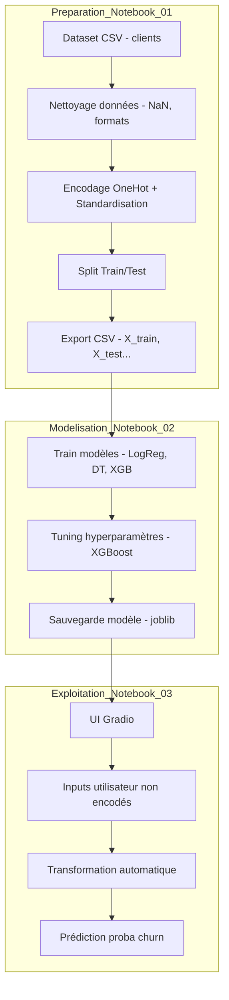

# 🧠 E-commerce Churn Prediction

Prédiction intelligente du churn client dans une plateforme e-commerce à l’aide du Machine Learning (XGBoost) et d’une interface utilisateur interactive Gradio.

---

## 🚀 Objectif du Projet

Anticiper les désabonnements (churn) des clients pour :

- Déclencher des actions de rétention ciblées.
- Améliorer la fidélité.
- Optimiser les campagnes marketing.
- Réduire les pertes de revenus.

---

## 🏗️ Architecture du Projet



---

## 📁 Structure du Répertoire

```
SCORE CHURN MODEL/
│
├── data/
│   ├── customers_data.csv
│   ├── X_train.csv
│   ├── X_test.csv
│   ├── y_train.csv
│   └── y_test.csv
│
├── models/
│   └── churn_xgb_model.pkl
│
├── notebooks/
│   ├── 01_preparation.ipynb
│   ├── 02_modélisation.ipynb
│   └── 03_exploitation.ipynb
```

---

## 🧪 Modèles Testés

| Modèle                | Accuracy (Test) | Observations              |
|-----------------------|-----------------|---------------------------|
| Logistic Regression   | ~91%            | Bonne baseline            |
| Decision Tree         | ~97%            | Overfitting               |
| XGBoost (Tuned)       | **~98.8%**      | ✅ Meilleur compromis     |

---

## 🧠 Variables Clés

| Variable                   | Effet sur le Churn                      |
|----------------------------|------------------------------------------|
| `Tenure`                  | Clients récents churnent plus           |
| `SatisfactionScore`       | Très corrélée au churn                  |
| `HourSpendOnApp`          | Moins d’heures = plus de churn          |
| `Complain`                | Se plaindre = indicateur de churn       |
| `OrderCount`, `CouponUsed`| Moins d’engagement = churn plus probable|

---

## 💡 Fonctionnalités de l'Application

- ✅ Interface utilisateur **intuitive (Gradio)**
- ✅ Entrée **non encodée** pour une meilleure expérience utilisateur
- ✅ Affichage **proba de churn (%)**
- ✅ Sauvegarde automatique du modèle `.pkl`
- ✅ Modèle prêt à être déployé en production

---

## 📦 Packages requis

```bash
pip install pandas numpy scikit-learn xgboost matplotlib seaborn gradio joblib
```

---

## ▶️ Lancer l'application Gradio

```bash
python app.py
```

Ou depuis un notebook :

```python
import gradio as gr
interface.launch()
```

---

## 📌 Auteurs

- **Moussa AOUINANE** – _Data Engineer / IA E-commerce_
- 📫 Contact : [LinkedIn](https://www.linkedin.com/) | [email@example.com](mailto:email@example.com)

---

## 📈 Prochaines Améliorations

- [ ] Ajout API REST avec FastAPI
- [ ] Automatisation du retraining (MLOps)
- [ ] Dashboard de suivi des churns
- [ ] Intégration CRM/Hubspot pour actions réelles

---

## Licence

Ce projet est sous licence MIT - libre à vous de l’adapter et l’utiliser.
